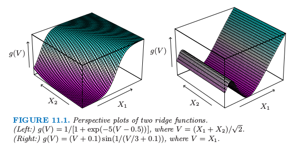

# 11.2 投影寻踪回归

| 原文   | [The Elements of Statistical Learning](https://web.stanford.edu/~hastie/ElemStatLearn/printings/ESLII_print12.pdf) |
| ---- | ---------------------------------------- |
| 翻译   | szcf-weiya                               |
| 时间   | 2017-02-07                               |
|更新| 2017-12-27; 2018-04-29|

在我们一般监督学习问题中，假设我们有 $p$ 个组分的输入向量 $X$，以及目标变量 $Y$．令 $\omega_m,m=1,2,\ldots, M$ 为未知参数的 $p$ 维单位向量．**投影寻踪回归 (PPR)** 模型有如下形式
$$
f(X)=\sum\limits_{m=1}^Mg_m(\omega_m^TX)\tag{11.1}
$$
这是一个可加模型，但是是关于导出特征 $V_m=\omega_m^TX$，而不是关于输入变量本身．函数 $g_m$ 未定，而是用一些灵活的光滑化方法来估计及 $\omega_m$ 的方向（见下）．

函数 $g_m(\omega_m^TX)$ 称为 $\IR^p$ 中的**岭函数 (ridge function)**．仅仅在由向量 $\omega_m$ 定义的方向上变化．标量变量 $V_m=\omega_m^TX$ 是 $X$ 在单位向量 $\omega_m$ 上的投影，寻找使得模型拟合好的 $\omega_m$，因此称为“投影寻踪”．图 11.1 显示了岭函数的一些例子．左边的例子 $w=(1/\sqrt{2})(1,1)^T$，使得函数仅仅在 $X_1+X_2$ 方向上变化．在右边的例子中，$\omega=(1,0)$．

> 图 11.1. 2 个岭函数的透视图．（左图：）$g(V)=1/[1+\exp(-5(V-0.5))]$ 其中 $V=(X_1+X_2)/\sqrt{2}$．（右图：）$g(V)=(V+0.1)\sin(1/(V/3+0.1))$，其中 $V=X_1$．

式子 \eqref{11.1} 的 PPR 模型是非常一般的，因为形成线性组合的非线性函数的操作得到相当多的模型类型．举个例子，乘积 $X_1\cdot X_2$ 可以写成 $[(X_1+X_2)^2-(X_1-X_2)^2]/4$，高阶的乘积也可以类似地表示．

实际上，如果 $M$ 任意大，选择合适的 $g_m$，PPR 模型可以很好地近似 $\IR^p$ 中任意的连续函数．这样的模型类别称为 **通用近似 (universal approximator)**．然而这种一般性需要付出代价．拟合模型的解释性通常很困难，因为每个输入变量都以复杂且多位面的方式进入模型中．结果使得 PPR 模型对于预测非常有用，但是对于产生一个可理解的模型不是很有用．$M=1$ 模型是个例外，也是计量经济学中的 **单指标模型 (single index model)**．这比线性回归模型更加一般，也提供了一个类似（线性回归模型）的解释．

给定训练点 $(x_i,y_i),i=1,2,\ldots,N$ 怎么拟合 PPR 模型？我们在函数 $g_m$ 和方向向量 $\omega_m,m=1,2,\ldots,M$ 上寻找误差函数的近似最小值
$$
\sum\limits_{i=1}^N\left[y_i-\sum\limits_{m=1}^Mg_m(\omega_m^Tx_i)\right]^2\tag{11.2}
$$
正如在其他光滑问题中一样，我们需要在 $g_m$ 上加上显式或隐式的限制来避免过拟合解．

仅仅考虑一项（$M=1$，并且去掉下标）．给定方向向量 $\omega$，我们得到导出变量 $v_i=\omega^Tx_i$．接着我们有一个一维光滑问题，而且我们可以应用任意散点图光滑器，比如光滑样条来得到 $g$ 的一个估计．

另一方面，给定 $g$，我们想要关于 $\omega$ 最小化 \eqref{11.2}．高斯-牛顿搜索可以很方便地实现这个任务．这是一个拟牛顿法，丢掉了 Hessian 阵中关于 $g$ 二阶微分的项．可以很简单地按照下面导出．令 $\omega_{old}$ 为 $\omega$ 的当前估计．我们写成
$$
g(\omega^Tx_i)\approx g(\omega_{old}^Tx_i)+g'(\omega_{old}^Tx_i)(\omega-\omega_{old})^Tx_i\tag{11.3}
$$
得到
$$
\sum\limits_{i=1}^N[y_i-g(w^Tx_i)]^2\approx \sum\limits_{i=1}^Ng'(\omega_{old}^Tx_i)^2\left[\left(\omega_{old}^	Tx_i+\frac{y_i-g(\omega_{old}^Tx_i)}{g'(w^T_{old}x_i)}\right)-w^Tx_i\right]^2\tag(11.4)
$$
为了最小化右边的项，我们在输入 $x_i$ 上对目标 $\omega_{old}^Tx_i+(y_i-g(\omega_{old}^Tx_i))/g'(\omega_{old}^Tx_i)$ 进行最小二乘回归，其中系数为 $g'(\omega_{old}^Tx_i)^2$ 并且没有截距（偏差）项．这样得到更新后的系数向量 $\omega_{new}$．

对 $g$ 和 $w$ 的估计的这两步一直迭代直到收敛．在 PPR 模型中不止一项时，以一种向前逐步的方式来建立模型，在每一步加入 $(\omega_m,g_m)$．

下面是一系列实现的细节．

- 尽管原则上可以使用任意光滑的方法，但如果某方法提供微分则更加方便．局部回归和光滑样条是很方便的．
- 每一步之后，上一步得到的 $g_m$ 可以运用第 9 章描述的 backfitting 过程来重新调节．尽管这会导致最终有更少的项，但是否提高预测表现不是很清楚．
- 通常 $\omega_m$ 没有被重新调整（部分是为了避免过度的计算），尽管原则上它们也可以被调整．
- 项数 $M$ 通常被估计为向前逐步策略的一部分．当下一项不再明显地改善模型的拟合则停止模型的建立过程．交叉验证可以用来确定 $M$．

有许多的应用中可以用到投影寻踪的想法，比如密度估计（Friedman et al., 1984[^1]; Friedman, 1987[^2]）．特别地，见 [14.7 节](../14-Unsupervised-Learning/14.7-Independent-Component-Analysis-and-Exploratory-Projection-Pursuit/index.html)中关于 ICA 的讨论以及它与探索型投影寻踪的关系．然而，投影寻踪回归模型在统计领域并没有被广泛地使用，或许是因为在它的提出时间（1981），计算上的需求超出大多数已有计算机的能力．但是它确实代表着重要的智力进步，它是一个在神经网络领域的转世中发展起来的，神经网络是本章接下来的内容．

[^1]: Friedman, J., Stuetzle, W. and Schroeder, A. (1984). Projection pursuit density estimation, Journal of the American Statistical Association 79: 599–608.
[^2]: Friedman, J. (1987). Exploratory projection pursuit, Journal of the American Statistical Association 82: 249–266.
