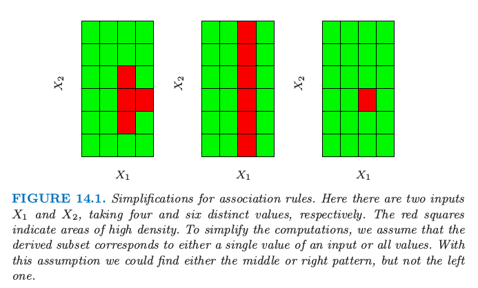
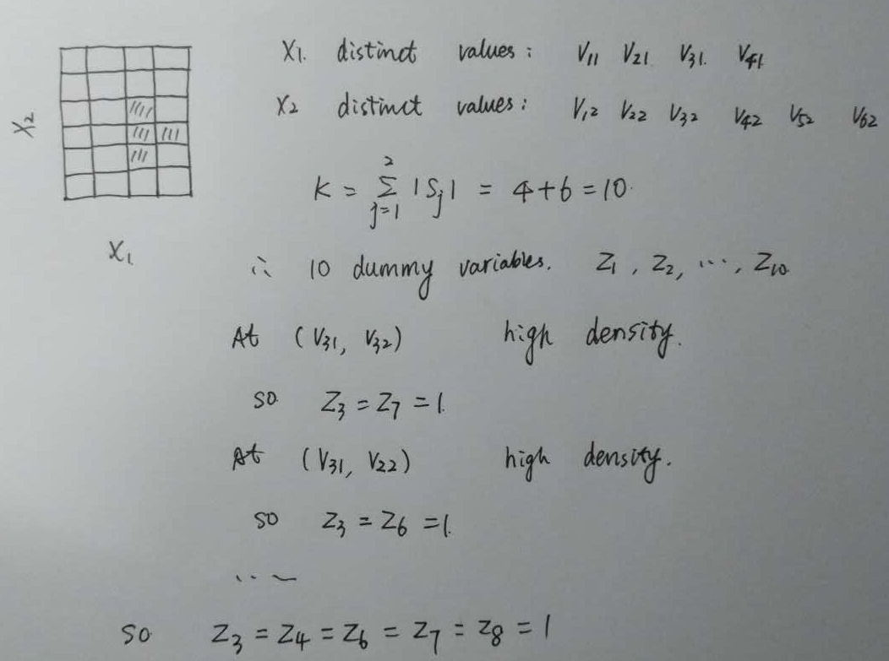
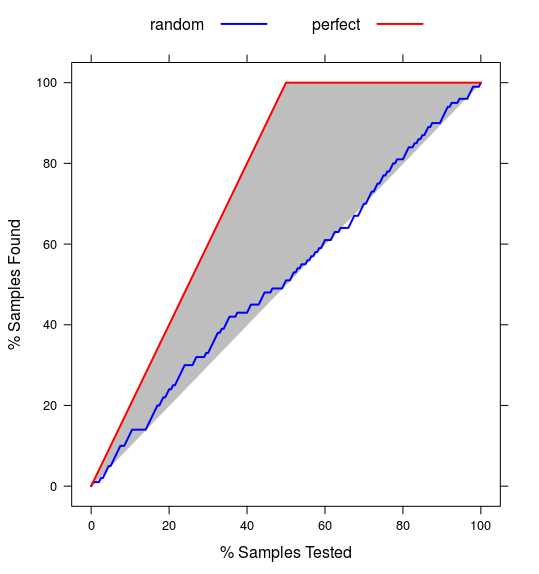
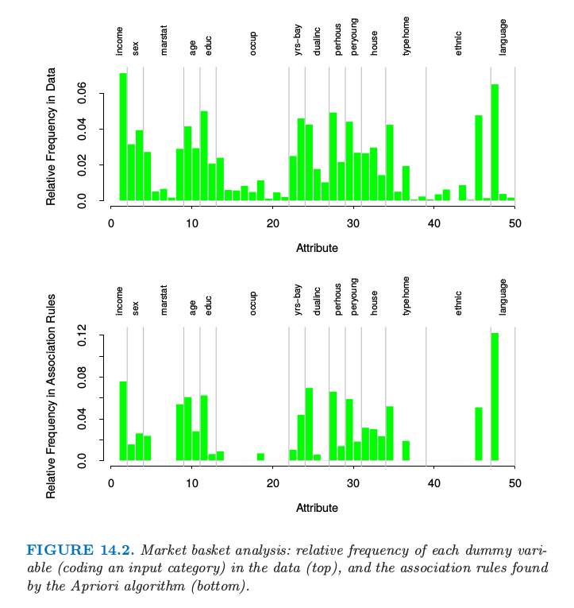
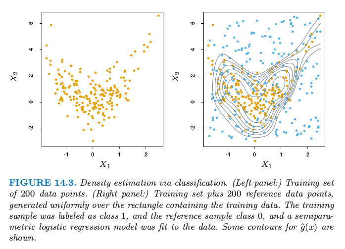
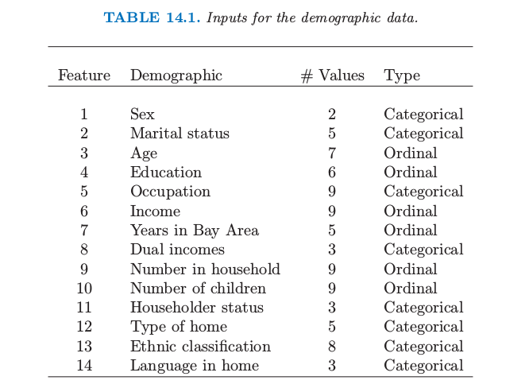

# 14.2 关联规则

| 原文   | [The Elements of Statistical Learning](https://web.stanford.edu/~hastie/ElemStatLearn/printings/ESLII_print12.pdf#page=506) |
| ---- | ---------------------------------------- |
| 翻译   | szcf-weiya                               |
| 时间   | 2017-02-20:2017-02-22                    |
|更新| 2018-03-20, 2018-03-21, 2019-04-03|
|状态| Done|

**关联规则分析 (Association rule analysis)** 已经成为挖掘贸易数据的流行工具．目标是寻找变量 $X=(X_1,X_2,\ldots,X_p)$ 在数据中出现最频繁的联合值．在二值数据 $X_j\in\{0,1\}$ 中应用最多，也称作“市场篮子”分析．这种情形下观测值为销售交易，比如出现在商店收银台的商品．变量表示所有在商店中出售的商品．对于观测 $i$，每个变量 $X_j$ 取值为 0 或 1；如果第 $j$ 个商品作为该次交易购买的一部分则 $x_{ij}=1$，而如果没有购买则 $x_{ij}=0$．这些经常有联合值的变量表示物品经常被一起购买．这个信息对于货架、跨营销的促销活动、商品目录的设计，以及基于购买模式的消费者划分都是很有用的．

更一般地，关联分析的基本目标是寻找 **特征向量 (feature vector)** $X$ 的 **原型 (prototype)** $X$ 值 $v_1,\ldots,v_L$ 的集合，使得概率密度 $\Pr(v_l)$ 在这些值上的取值相对大．在一般框架下，这个问题可以看成是“**模式寻找 (mode finding)**”或者“**碰撞狩猎 (bump hunting)**”．如所阐释的，这个问题是非常困难．每个 $\Pr(v_l)$ 一个很自然的估计是 $X=v_l$ 时观测的比例．对于涉及不止一个变量的问题，每个变量都可以假定不止一个值，要得到可靠估计，$X=v_l$ 的观测值的个数几乎总是太少．

进行第一次简化来修改目标．与其寻找 $\Pr(x)$ 很大时的 $x$ **值 (values)**，不如在 $X$ 空间中寻找相对它们大小和支撑集而言的大概率部分的 **区域 (regions)**．令 $\cal S_j$ 表示第 $j$ 个变量的所有可能值的集合（**支撑集 (support)**），并且令  $s_j\subseteq\cal S_j$ 为这些值的子集．修改后的目标可以叙述成试图寻找变量值的子集 $s_1,\ldots,s_p$ 来使得每个变量的概率同时相对地大，假设每个子集中都有一个值，则也就是使得

$$
\Pr\Big[\bigcap_{j=1}^p(X_j\in s_j)\Big]\tag{14.2}\label{14.2}
$$

相对大．子集的交 $\cap_{j=1}^p(X_j\in s_j)$ 称作 **联合规则 (conjunctive rule)**．对于定性变量，子集 $s_j$ 为邻接区间；对于类别型变量，子集是明确界定的．注意到如果子集实际上是整个集合 $s_j=\cal S_j$，经常是这种情形，变量 $X_j$ 被称为没有出现在规则 \eqref{14.2} 中．

## 市场篮子分析

求解 \eqref{14.2} 的一般方法将在 14.2.5 节讨论．这在许多应用中是很有用的．然而，它们对于非常多 ($p\approx 10^4,N\approx 10^8$) 的交易数据是不可行的，但市场篮子分析经常要应用到这些数据上．所以需要对 \eqref{14.2} 进一步简化．首先，只考虑两种类型的子集；$s_j$ 要么只包含 $X_j$ 的单个值 $s_j=v_{0j}$，要么包含 $X_j$ 的所有值，$s_j=\cal S_j$．这将 \eqref{14.2} 简化为寻找元素为整数的子集 $\cal J\subset\\{1,\ldots,p\\}$，以及对应的值 $v_{0j},j\in\cal J$，使得

$$
\Pr\Big[\bigcap_{j\in \cal J}(X_j=v_{0j})\Big]\tag{14.3}\label{14.3}
$$

相对大．图 14.1 解释了这个假设．

> 图14.1. 关联规则的简化．这里有两个输入 $X_1$ 和 $X_2$，分别取 4 和 6 个不同的值．红色方块表示高密度的区域．为了简化计算，我们假设导出的子集要么对应输入的单个值，要么对应所有值．有了这个假设，我们可以找到图中中间或者右边的模式，而不是左边的模式．

可以应用 **虚拟变量 (dummy variables)** 的技巧将 \eqref{14.3} 转换为只涉及二值变量的问题．这里我们假设支撑集 $\cal S_j$ 对于每个变量 $X_j$ 都是有限的．具体地，构造新的变量集 $Z_1,\ldots,Z_K$，对于可由每个原始变量 $X_1,X_2,\ldots,X_p$ 取得的每个值 $v_{lj}$ ，创建一个这样的变量．虚拟变量的数目 $K$ 为

$$
K=\sum\limits_{j=1}^p\vert \cal S_j\vert
$$

其中 $\vert \cal S_j\vert$ 为从 $X_j$ 得到的唯一值的个数．

如果与其相关联的变量取 $Z_k$ 对应的值，则每个虚拟变量被赋值为 $Z_k=1$，否则$Z_k=0$（**weiya注：**见注中的图片）． 

!!! notes "weiya 注"
    每个 $v_{lj}$（可看成是 $p$ 维列向量）都有一个虚拟变量 $Z_{\ell}$．

	

这将 \eqref{14.3} 转换为寻找整数集 ${\cal K}\subset\\{1,\ldots,K\\}$ 使得下式的值大．

$$
\Pr\Big[\bigcap_{k\in\cal K}(Z_k=1)\Big]=\Pr\Big[\prod\limits_{k\in\cal K}Z_k=1\Big]\tag{14.4}\label{14.4}
$$

这是市场篮子问题的标准形式．集合 $\cal K$ 称为“**项目集 (items set)**”．项目集中的变量 $Z_k$ 的个数称为“大小 (size)”（注意到这个大小不大于 $p$）．\eqref{14.4} 的估计值取为在数据集中式 \eqref{14.4} 中关联为真的观测的比例：

$$
\widehat{\Pr}\Big[\prod\limits_{k\in\cal K}(Z_k=1)\Big]=\frac{1}{N}\sum\limits_{i=1}^N\prod_{k\in\cal K}z_{ik}\tag{14.5}\label{14.5}
$$

其中 $z_{ik}$ 为 $Z_k$ 的第 $i$ 种情形的值．上式称作项目集 $\cal K$ 的“支撑 (support)”或“流行 (prevalence)” $T(\cal K)$．$\prod_{k\in\cal k}z_{ik}=1$ 的观测 $i$ 称作“包含 (contain)”项目集 $\cal K$ ．

在关联规则挖掘中确定支撑的下界 $t$，并且寻找所有可以由变量 $Z_1,\ldots,Z_k$ 组成的项目集 $\cal K_l$，并且支撑集大于下界 $t$，也就是

$$
\{{\cal K_l}\mid T({\cal K_l})>t\}\tag{14.6}\label{14.6}
$$

## Apriori 算法

如果调整阈值 $t$ 使得式 \eqref{14.6} 仅由所有 $2^K$ 中可能的项集合中的一小部分构成，则对于非常大的数据集，可以通过可行的计算得到 \eqref{14.6} 的解．“Apriori”算法（Argawal et al.，1995[^1]）探究维数灾难的某些方面，采用小部分的数据传递求解 \eqref{14.6}．具体地，对于给定的支撑阈值 $t$：

- $\\{{\cal K}\mid T(\cal K)>t \\}$ 的 **基数(cardinality)** 相对小．
- 任意由项目集 $\cal K$ 中子集组成的集合 $\cal L$ 必须有比 $\cal K$ 大或相等的支撑，即 ${\cal L\subseteq K}\Rightarrow T({\cal L})\ge T({\cal K})$

第一次传递数据计算所有单项目集合的支撑．舍弃那些支撑小于阈值的项目集．第二次传递数据计算所有可以通过第一次传递中保留下来的单项目集合匹配成对的项目集（此时大小为 2）的支撑．换句话说，为了产生所有大小为 $\vert\cal K\vert=m$ 的高频率项目集，我们仅仅需要考虑部分候选项目集，每个候选项目集的 $m$ 个大小为 $m-1$ 的上一级项目集是高频率的．

!!! note "weiya 注："
    对于给定的大小为 $m$ 的项目集 $\cal K$，它有 $m$ 个大小为 $m-1$ 的父项目集．

舍弃那些支撑小于阈值的大小为 2 的项目集．每个后继的传递数据只考虑了那些可以通过结合上一次传递数据存留的项目集与第一次传递数据保留下的项目集得到的项目集．数据传递过程一直进行下去，直到来自上一次传递的所有候选规则的支撑都小于指定阈值．Apriori 算法仅要求对 $\vert\cal K\vert$ 个值的每一个进行一次数据传递，这是很重要的，因为我们假设数据不能放在计算机的主存中．如果数据是充分稀疏（或者如果阈值 $t$ 充分大），则会在合理次数之后终止过程，甚至对非常大的数据集也是如此．

许多额外的技巧可以作为这个策略的一部分来提高速度和收敛（Agrawal et al., 1995[^1]）．Apriori 算法标志数据挖掘技术的主要进步．

通过 Apriori 算法返回的每个高支撑的数据集 $\cal K$ \eqref{14.6} 被放到“关联规则”的集合中．项目 $Z_k,k\in\cal K$ 被分成两个分离的子集，$A\cup B=\cal K$，并且写成

$$
A\Rightarrow B\tag{14.7}
$$

第一项子集 $A$ 被称作“先因 (antecedent)”，第二个子集 $B$ 被称为“后果 (consequent)”．关联规则基于在数据库中 antecedent 和 consequent 项目集的流行程度，来定义具有一些性质．规则 $T(A\Rightarrow B)$ 的“支撑”是在先行项目集和后果项目集的并集中的观测的占比，这恰恰是导出它们的项目集 $\cal K$ 的支撑．可以看成在随机选择的市场篮子中同时观测项目集 $\Pr(A\; and\; B)$ 的概率的估计 \eqref{14.5}．该规则的“**置信度 (confidence)**” 或“**可预测性 (predictability)**” $C(A\Rightarrow B)$ 是它的支撑除以 antecedent 的支撑

$$
C(A\Rightarrow B)=\frac{T(A\Rightarrow B)}{T(A)}\tag{14.8}
$$

可以看成是 $\Pr(B\mid A)$ 的估计．记号 $\Pr(A)$ 是在篮子中出现项目集 $A$ 的概率，是 $\Pr(\prod_{k\in A}Z_k=1)$ 的缩写．“**期望置信度**”定义为 consequent 的支撑 $T(B)$，是无条件的概率 $\Pr(B)$ 的估计．最后，规则的 “lift” 定义为置信度除以期望置信度

$$
L(A\mid B)=\frac{C(A\Rightarrow B)}{T(B)}
$$

这是关联衡量 $\Pr(A\; and\; B)/\Pr(A)\Pr(B)$ 的估计．

!!! note "weiya 注：lift vs. Lift Chart "
    在评估预测模型时，有时会作出 Lift Chart，与这里的 lift 看起来很像．画 Lift Chart 时，
    
    1. 首先对测试样本进行预测计算某一事件（比如有 $K$ 个类别，考虑其中的类 a）的类别概率，根据类别概率从大到小排序；
    2. 给定一个**概率阈值**，计算第 1 步中所有小于该概率的样本中该事件发生的比例（比如类别概率小于 0.8 的样本中类别 a 的比例）
    3. 计算**基准 (baseline) 事件率**，也就是全样本集中所考察的事件的比例（比如类别 a 的比例），第 2 步的比例除以基准事件率则得到该阈值下的 **lift**．

    很直观地，可以发现关联规则中的 lift 与 Lift Chart 的计算方法很像，概率阈值就相当于**支撑阈值 $t$**，基准事件率对应 $T(B)$，而小于阈值时样本中事件发生的比例对应 $C(A\Rightarrow B)$．

    R 中作出 Lift Chart 的命令也很简单，直接调用 `caret` 包中的 `lift` 函数可以作出如下的 Lift Chart（采用的是示例代码）

    

举个例子，假设项目集为 ${\cal K}=$ {`peanut butter`, `jelly`, `bread`}，并且考虑规则 {`peanut butter`, `jelly`} $\Rightarrow$ {`bread`}．$0.03$ 的支撑值表示 `peanut butter`，`jelly` 和 `bread`同时出现在 $3\%$ 的市场篮子中．这个规则的 0.82 置信度表示当购买了 `peanut butter` 和 `jelly`，$82\%$ 的情形下也会购买 `bread`．如果`bread` 在 $43\%$ 的市场篮子中，则规则 {`peanut butter`, `jelly`}$\Rightarrow$ {`bread`} 的 lift 为 $1.95$．

这个分析的目标是得到支撑和置信度 (14.8) 都高的关联规则 (14.7)．Apriori 算法返回由支撑阈值 $t$ (14.6) 定义的所有高支撑的项目集．设定置信度阈值 $c$，报告所有可以从这些项目集 (14.6) 中组成的置信度大于 $c$ 的规则，也就是
$$
\{A\Rightarrow B\mid C(A\Rightarrow B)>c\}\tag{14.9}
$$
对于大小为 $\vert\cal K\vert$ 的项目集 $\cal K$，有 $2^{\vert{\cal K}\vert-1}-1$ 条形式为 $A\Rightarrow ({\cal K}-A),A\subset \cal K$ 的规则．

!!! notes "weiya 注"
    $$
    \frac{1}{2}(2^{\vert\cal K\vert}-2)=2^{\vert{\cal K}-1\vert}-1
    $$

Agrawal et al. (1995)[^1] 提出 Apriori 算法的一个变体，它可以从由项目集 (14.6) 构造的所有可能的规则中快速确定哪些规则会在置信阈值 (14.9) 下存留下来．

整个分析的输出是满足下面约束的关联规则（14.7）的集合．

$$
T(A\Rightarrow B)>t\qquad and\qquad C(A\Rightarrow B)>c
$$

这些一般保存在数据库中，可以被用户查询到．一般的查询请求可能是按照置信度，lift 或者支撑的大小顺序排列规则．更具体地，可能会要查询在 antecedent中 含特定的项目或在 consequent 中含特定的项目的条件下的列表．举个例子，一条查询请求可能如下：

> 显示 ice skates 为 consequent，置信度大于 $80\%$ 且支撑大于 $2\%$ 的所有交易．

这可以提供能够预测 ice skates 销量的项（antecedent）的信息．关注特定的结果（consequent）便将问题转换成了监督学习的框架．

关联规则成为了在相关的市场篮子的设定下用于分析非常大的交易数据库的流行工具．这是当数据可以转换成多维邻接表的形式时．输出是以容易理解并且可解释的关联规则 (14.4) 的形式展现的．Apriori 算法允许分析可以用到大的数据库中，更大的数据库适用于其他类型的分析．关联规则是数据挖掘最大的成功之一．

除了对我们可以应用的数据有限制外，关联规则还有其它的限制．计算可行性的关键是支撑阈值 (14.6)．项目集的解的个数，它们的大小，以及对数据需要传递的次数随着下界的下降指数型增长．因此，不会发现有高置信度或者高 lift，但是低支撑的规则．举个例子，比如将不会找到 `vodka` $\Rightarrow$ `caviar` 的高置信度规则，因为后果（consequent）`caviar` 的低销售量．

## 例子：市场篮子分析

我们将在中等大小的人口统计数据库中说明 Apriori 算法的使用．数据集包含 $N=9409$ 份问卷，由旧金山湾区 (San Francisco Bay Area) 的购物商场里的消费者填写的（Impact Resources, Inc., Columbus OH, 1987）．这里我们采用前 14 个与人口统计有关的问题的回答来说明．数据中包含顺序型和（无序）类别变量，后者中的许多具有多个值．并且有许多缺失数据．

我们采用 Apriori 算法的免费软件实现，这归功于 Christian Borgelt．（见 [http://fuzzy.cs.uni-magdeburg.de/~borgelt](http://www.borgelt.net/)）．除去缺失数据的观测，每个顺序型预测变量在中值处分开并且用两个虚拟变量来编码；每个含有 $k$ 个类别的类别型预测变量用 $k$ 个虚拟变量编码．得到 $6876\times 50$ 阶矩阵，$6876$ 为观测个数，$50$ 为虚拟变量个数．

这个算法总共找到 $6288$ 条关联规则，涉及 $\le 5$ 个预测变量，支撑至少为 $10%$．理解这个大的规则集合本身是具有挑战的数据分析工作．我们这里将不会试图解决，但仅仅在图 14.2 中说明每个虚拟变量在数据中的相对频率（上）和在关联规则中的相对频率（下）．受欢迎的类别趋向于在规则中频繁出现，例如，排第一的类别是 language (English)．然而，其他的像职业 (occupation) 则表现出**代表人数不足 (under-represented)**，除了第一和第五个水平．

> 图14.2. 市场篮子分析：每个虚拟变量（对输入类别编码）在数据中的相对频率（上），以及在由 Apriori 算法找到的关联规则中的相对频率（下）

下面是通过 Apriori 算法找出的关联规则的三个例子：

- 关联规则 1：25% 的支撑，99.7% 的置信度，1.03 的 lift

- 关联规则 2：13.4% 的支撑，80.8% 的置信度，2.13 的 lift

- 关联规则 3：26.5% 的支撑，82.8% 的置信度，2.15 的 lift

根据高支撑，我们选择第一和第三条规则．第二条规则是有高收入的 consequent 的关联规则，并且可以用来试图挑出高收入的个体．

正如上面叙述的，我们对每个输入预测变量构造虚拟变量，举个例子，根据收入低于和高于中位数得到 $Z_1=I(\text{income} < \$40,000)$ 和 $Z_2=I(\text{income}\ge \$40,000)$．如果我们仅仅对寻找与高收入类别的关联感兴趣，我们可能会包含 $Z_2$但不包含 $Z_1$．实际市场篮子问题中经常是这种情形，我们感兴趣的是找到与现存的相对罕见项的关联，而不是跟它缺失有关的关联．

## 作为监督学习的非监督

这里我们讨论将密度估计问题转化为某监督函数近似的技巧．这是将在下一节描述的广义关联规则的基础．

令 $g(x)$ 为需要估计的未知数据概率密度，且 $g_0(x)$ 为用作参考的确定的概率密度函数．举个例子，$g_0(x)$ 可能是在变量定义域上的均匀概率密度．其他的概率类型在下面讨论．假定数据集 $x_1,x_2,\ldots,x_N$ 是从 $g(x)$ 中抽取的独立同分布的样本．大小为 $N_0$ 的样本可以通过蒙特卡洛法从 $g_0(x)$ 中抽取．混合这两个数据集，并且对从 $g(x)$ 抽取的样本赋权 $\omega=N_0/(N+N_0)$，对从 $g_0(x)$ 中抽取的样本赋权 $\omega_0=N/(N+N_0)$，得到从混合密度 $(g(x)+g(x_0))/2$ 中抽取的随机样本．如果对从 $g(x)$ 中抽取的样本赋值为 $Y=1$，对从 $g_0(x)$ 中抽取的样本赋值为 $Y=0$，则

$$
\begin{align}
\mu(x)=E(Y|x)&=\frac{g(x)}{g(x)+g_0(x)}\\
&=\frac{g(x)/g_0(x)}{1+g(x)/g_0(x)}\tag{14.10}
\end{align}
$$

可以通过将下面的混合样本作为训练数据，然后采用监督学习的方法来估计

$$
(y_1,x_1),(y_2,x_2),\ldots,(y_{N+N_0},x_{N+N_0})\tag{14.11}
$$

估计的结果 $\hat \mu(x)$ 可以反解得 $g(x)$ 的估计

$$
\hat g(x)=g_0(x)\frac{\hat \mu(x)}{1-\hat\mu(x)}\tag{14.12}
$$

广义逻辑斯蒂回归（[4.4 节](../04-Linear-Methods-for-Classification/4.4-Logistic-Regression/index.html)）是非常适用于这个方法，因为 log-odd 是直接估计的

$$
f(x)=\log\frac{g(x)}{g_0(x)}\tag{14.13}
$$

此时我们有

$$
\hat g(x)=g_0(x)e^{\hat f(x)}\tag{14.14}
$$

图 14.3 显示了一个例子．我们在左边图中产生大小为 200 的训练集．右边显示了在图中长方形区域内均匀产生的参考点（蓝色）．训练样本被标号为 1，而参考样本标号为 0，并且采用逻辑斯蒂回归模型对数据进行拟合，逻辑斯蒂回归模型使用自然样条的张量积（[5.2.1 节](../05-Basis-Expansions-and-Regularization/5.2-Piecewise-Polynomials-and-Splines/index.html)）．$\mu(x)$ 的概率等高线展示在右图中；它们也是密度估计 $\hat g(x)$ 的等高线，因为 $\hat g(x)=\hat\mu(x)/(1-\hat\mu(x))$ 是单调函数．等高线大致捕捉了数据的密度．

> 图14.3. 通过分类的密度估计．（左）200 个数据点的训练集．（右）加上在矩形区域内均匀产生 200 个参考数据点的训练集．训练样本标记为类别 1，参考数据点为类别 0，对数据用半参逻辑斯蒂回归模型进行拟合．图中显示了 $\hat g(x)$ 的等高线．

原则上任意参考点都可以作为 (14.14) 的 $g_0(x)$．实际中估计 $\hat g(x)$ 的准确性非常依赖于特定的选择．好的选择会取决于数据密度 $g(x)$ 和用来估计 (14.10) 和 (14.13) 的过程．如果目标是正确性，应该选择 $g_0(x)$ 使得最终函数 $\mu(x)$ 和$f(x)$ 可以简单地被使用的方法来近似．然而，准确性不总是主要目标．$\mu(x)$ 和 $f(x)$ 是概率比率 $g(x)/g_0(x)$ 的单调函数．它们可以看成是提供关于数据密度 $g(x)$ 与 $g_0(x)$ 偏离的信息的“差异”统计量．因此，在数据分析设定中，$g_0(x)$ 的选择是由偏离的类型决定的，实际中特定问题的情况下似乎是最有趣的．举个例子，如果我们感兴趣的是均匀的偏离，则 $g_0(x)$ 可能是变量值域上的均匀密度函数．如果与联合正态的偏离是我们感兴趣的，$g_0(x)$ 的一个好的选择是与原数据相同的均值向量和协方差均值．与独立性的偏离可以通过用下式表征：

$$
g_0(x)=\prod\limits_{j=1}^pg_j(x_j)\tag{14.15}
$$

其中 $g_j(x_j)$ 为 $X_j$（$X$ 的第 $j$ 个坐标）的边缘密度．通过对每个变量的数据应用不同的随机排列，独立密度 (14.15) 的样本可以很简单地从数据本身产生．

正如上面讨论的那样，非监督学习关心揭示数据密度 $g(x)$ 的性质．每个技巧关注与特定的性质或者某些性质．尽管这种将问题转换为监督学习的方式看起来在一段时间内成为**统计民俗学 (statistics folklore)** 的一部分，但它似乎没有太大的影响，尽管它有将已经研究透彻的监督学习方法应用到非监督学习的潜力．其中一个原因可能是这个问题必须要用蒙特卡洛技巧产生的模拟数据来扩大．因为数据集的大小至少和数据样本一样大 $N_0\ge N$，这个估计过程的计算和内存上的要求至少双倍．另外，实质上的计算可能要求产生蒙特卡洛本身．尽管在过去这是一个限制，但是这增加的计算需求不值得成为一个负担，因为增加的资源也变成了可能．我们将在下一节说明在非监督学习中监督学习方法的使用．

## 广义关联规则

在数据空间中寻找高密度区域的更一般问题 (14.2) 可以通过使用上面描述的监督学习的方法来解决．尽管不能应用对市场篮子分析可行的大数据库，但可以从适当大小的数据集中得到有用的信息．问题 (14.2) 可以用公式叙述为，寻找整数子集 $\cal J\subset\{1,2,\ldots,p\}$ 和与对应的变量 $X_j$ 对应的子集 $s_j,j\in \cal J$ 使得下式的值大．

$$
\widehat{\Pr}\Big(\bigcap_{j\in\cal J}(X_j\in s_j)\Big) = \frac{1}{N}\sum\limits_{i=1}^NI\Big(\bigcap_{j\in\cal J}(x_{ij}\in s_j)\Big)\tag{14.16}
$$

根据关联规则的数据，$\\{(X_j\in s_j)\\}_{i\in \cal J}$ 将被称为“广义”项目集．对应定量变量的子集 $s_j$ 取为在它们值域中的邻接区间，对于类别型变量的子集可以涉及不止一个单值．这种方法的这条“野心的 (ambitious)” 性质阻碍了对所有广义项目集的全面搜索，来寻找式 (14.16) 大于特定最小值的支撑．必须用到启发式搜索算法，而且最希望有个寻找这样广义项目集的集合．

市场篮子分析 (14.5) 和广义公式 (14.16) 都隐式地引用均匀概率分布．如果所有的联合数据值 $(x_1,x_2,\ldots,x_N)$ 都是均匀分布的，则寻找比期望更频繁的项目集．这有助于寻找单个边缘组分 $(X_j\in s_j)$ 是频繁的项目集，也就是，下式的值大．
$$
\frac{1}{N}I(x_{ij}\in s_j)\tag{14.17}
$$

频繁子集 (14.17) 的联合在高支撑的项目集（14.16）中趋向于比不频繁子集的联合更经常出现．这也就是为什么尽管高关联（lift）的规则 `vodka`$\Rightarrow$`caviar` 不可能被发现；因为没有一项含有高的边缘支撑，所以它们的联合支撑特别地小．引用均匀分布可以得出高频率项目集，其组成部分之间具有低关联性，以支配最高支撑项目集合的集合．

高频率子集 $s_j$ 形成为最频繁的 $X_j$ 值的分离．采用变量边缘数据密度的积（14.15）作为参考分布，移除了在已发现项目集中单个变量的高频值的偏好．这是因为不管单个变量值的频率分布，如果变量中没有关联（完全独立），密度比率 $g(x)/g_0(x)$ 是均匀的．像 `vodka`$\Rightarrow$`caviar` 的规则会有机会进行合并．然而，怎样将参考分布而不是均匀分布纳入进 Apriori 算法中是不清晰的．正如在14.2.4节中解释的那样，给定原始数据集，从积密度（14.15）中产生样本是直接的．

选择完参考分布后，并且根据它抽取样本，如 (14.11)，则得到一个关于二值输出变量 $Y\in\\{0,1\\}$ 的监督学习问题．目标是利用这些数据去寻找区域

$$
R=\bigcup_{j\in \cal J}(X_j\in s_j)\tag{14.18}
$$

使得目标函数 $\mu(x)=E(Y\mid x)$ 相对地大．另外，可能希望要求这些区域的数据支撑

$$
T(R)=\int_{x\in R}g(x)dx\tag{14.19}
$$

不要太小．

## 监督学习方法的选择

区域 (14.18) 由联合规则定义．因此在这种情形下学习这些规则的监督学习方法会是最合适的．CART 决策树的终止结点由形式为(14.18) 的规则精确定义．对混合数据 (14.11) 应用 CART 会得到决策树，决策树试图在整个数据空间用不相交的区域集合对目标 (14.10) 建模．每个区域由形式为（14.18）中的一条规则而定义．这些有较高 $y$ 平均值
$$
\bar y_t=\text{ave}(y_i\mid x_i\in t)
$$
是高支撑广义项目集（14.16）的候选者．实际的（数据）支撑由下式给出
$$
T(R)=\bar y_t\cdot \frac{N_t}{N_t+N_0}
$$
其中 $N_t$ 是由终止结点表示的区域中（混合）观测的个数．通过检查得到的决策树，可能会发现相对高支撑的感兴趣的项目集．这些可以分化出在搜寻高置信度和/或 lift 的广义关联规则中的 antecedent 和 consequent．

用于这个目的的另外一种自然学习的方法是在[第 9.3 节](../09-Additive-Models-Trees-and-Related-Methods/9.2-Tree-Based-Methods/index.html)描述的**耐心规则诱导法 (PRIM)**，它也产生了形为 (14.18) 的精确规则，但是它是特别为寻找高支撑区域来在其中最大化目标 (14.10) 的平均值而设计的，而不是试图用在整个数据空间中建立目标函数的模型．它也控制了在支撑/平均目标值之间权衡．

[练习 14.3](https://github.com/szcf-weiya/ESL-CN/issues/94) 提出一个问题，问题产生于任何一种方法从边缘分布的积中生成随机数据的时候．

## 例子：市场篮子分析（继续）

我们在表 14.1 的人口统计数据的基础上说明 PRIM 的用法．

从PRIM分析中合并后的高支撑的广义项目集中的三个如下：

项目集 1：支撑 = 24%

项目集 2：支撑 = 24%

项目集 3：支撑 = 15%

从这些项目集中以大于 95% 的置信度 (14.8) 导出广义关联规则如下：

关联规则1：支撑 25%，置信度 99.7%，以及 lift 1.35

关联规则2：支撑 25%，置信度 98.7%，以及 lift 1.97

关联规则3：支撑 25%，置信度 95.9%，以及 lift 2.61

关联规则4：支撑 15%，置信度 95.4%，以及 lift 1.50

这些特殊的规则中没有太大的惊奇．其中的大部分符合直观．在其他缺少先验信息的情形下，期望之外的结果有更大的可能会进行合并．这些结果缺失说明了广义关联规则可以提供的信息种类，以及说明了规则导出方法的监督学习方法，比如 CART 或 PRIM，可以揭示在它们成分中保持高关联的项目集．

这些广义关联规则与之前通过 Apriori 算法找出的规则相比怎么样呢？因为 Apriori 过程给出了成千上万条规则，很难去比较它们．然而，可以对一些一般的点进行比较．Apriori 算法是穷举的——它找出所有支撑大于特定值的所有规则．相反地，PRIM 是贪婪算法，并且不保证给出“最优”的规则集．另一方面，Apriori 算法仅仅可以处理虚拟变量，也因此不能找到上面的一些规则．举个例子，因为 `type of home` 是类别型输入，对于每一层有一个虚拟变量，Apriori 不能找到涉及集合

$$
 \text{type of home} \neq \text{apartment}
$$

的规则．为了找到这个集合，我们必须对 `apartment` 和其他 home 的类别变量用虚拟变量编码．一般地对所有潜在的感兴趣的比较进行预先编码是不可行的．

[^1]: Agrawal, R., Mannila, H., Srikant, R., Toivonen, H. and Verkamo, A. I. (1995). Fast discovery of association rules, Advances in Knowledge Discovery and Data Mining, AAAI/MIT Press, Cambridge, MA.
