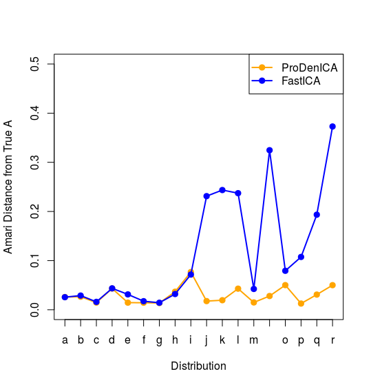
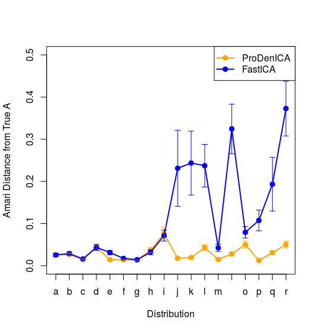

# 模拟：Fig. 14.42

| R Notebook   | [模拟：Fig. 14.42](http://rmd.hohoweiya.xyz/sim_14_42.html) |
| ---- | ---------------------------------------- |
| 作者   | szcf-weiya                               |
| 时间   | 2018-01-22                               |
| 更新 | 2018-02-04 |

本笔记是[ESL14.7节](https://esl.hohoweiya.xyz/14%20Unsupervised%20Learning/14.7%20Independent%20Component%20Analysis%20and%20Exploratory%20Projection%20Pursuit/index.html)图14.42的模拟过程。第一部分将以`ProDenICA`法为例试图介绍ICA的整个计算过程；第二部分将比较`ProDenICA`、`FastICA`以及`KernelICA`这种方法，试图重现图14.42。

## ICA的模拟过程

### 生成数据

首先我们得有一组独立（ICA的前提条件）分布的数据$S$（未知），然后经过矩阵$A_0$混合之后得到实际的观测值$X$，即

$$
X= SA_0
$$

也可以写成
$$
S=XA_0^{-1}
$$

用鸡尾酒酒会的例子来说就是，来自不同个体的说话声经过麦克风混合之后得到我们实际接收到的信号。假设有两组独立同分布的数据，分布都为`n`（对应图14.42中的编号），每组数据个数均为$N=1024$，混合矩阵为`A0`，用R代码描述这一过程如下

```R
library(ProDenICA)
p = 2
dist = "n"
N = 1024
A0 = mixmat(p)
s = scale(cbind(rjordan(dist,N),rjordan(dist,N)))
x = s %*% A0
```

最终我们得到观测值`x`。

### 白化

在进行ICA时，也就是恢复$X=S\mathbf A$中的混合矩阵$\mathbf A$，都会假设$X$已经白化得到$\mathrm{Cov}(X)=\mathbf I$，而这个处理过程可以用SVD实现。对于中心化的$X$，根据

$$
X=\mathbf{UDV}^T= \sqrt{N}\mathbf U\frac{1}{\sqrt{N}}\mathbf{DV}^T=X^*\frac{1}{\sqrt{N}}\mathbf{DV}^T
$$

得到满足$Cov(X^*)=\mathbf I$的$X^*$，则

$$
S=XA_0^{-1}=X^*DV^TA_0^{-1}/\sqrt{N}
$$

于是经过这个变换之后，混合矩阵变为

$$
A = DV^TA_0^{-1}/\sqrt{N}
$$

则
$$
X^*=SA^T
$$

用R语言表示如下

```R
x <- scale(x, TRUE, FALSE) # central
sx <- svd(x)
x <- sqrt(N) * sx$u # satisfy cov(x) = I
target <- solve(A0)
target <- diag(sx$d) %*% t(sx$v) %*% target/sqrt(N) # new mixing maxtrix
```

### `ProDenICA`法

细节不再展开，直接利用`ProDenICA`中的包进行计算

```R
W0 <- matrix(rnorm(2*2), 2, 2)
W0 <- ICAorthW(W0)
W1 <- ProDenICA(x, W0=W0,trace=TRUE,Gfunc=GPois)$W
```

得到$A$的估计值`W1`

### 计算Amari距离

```R
amari(W1, target)
```


## 比较两种算法

这一部分试图重现Fig. 14.42。

```R
N = 1024

genData <- function(dist, N = 1024, p = 2){
  # original sources
  s = scale(cbind(rjordan(dist, N), rjordan(dist, N)))
  # mixing matrix
  mix.mat = mixmat(2)
  # original observation
  x = s %*% mix.mat

  # central x
  x = scale(x, TRUE, FALSE)
  # whiten x
  xs = svd(x)
  x = sqrt(N) * xs$u # new observations
  mix.mat2 = diag(xs$d) %*% t(xs$v) %*% solve(mix.mat) / sqrt(N) # new mixing matrix
  return(list(x = x, A = mix.mat2))
}

res = array(NA, c(2, 18, 30))
for (i in c(1:18)){
  for (j in c(1:30)){
    data = genData(letters[i])
    x = data$x
    A = data$A
    W0 <- matrix(rnorm(2*2), 2, 2)
    W0 <- ICAorthW(W0)
    # ProDenICA
    W1 <- ProDenICA(x, W0=W0,trace=FALSE,Gfunc=GPois, restarts = 5)$W
    # FastICA
    W2 <- ProDenICA(x, W0=W0,trace=FALSE,Gfunc=G1, restarts = 5)$W
    res[1, i, j] = amari(W1, A)
    res[2, i, j] = amari(W2, A)
  }
}

res.mean = log(1+apply(res, c(1,2), mean))
#offset = apply(res, c(1,2), sd)
#offset = 0
#res.max = res.mean + offset/4
#res.min = res.mean - offset/4
res.max = apply(res, c(1,2), max)
res.min = apply(res, c(1,2), min)

# plot
plot(1:18, res.mean[1, ], xlab = "Distribution", ylab = "Amari Distance from True A", xaxt = 'n', type = "o", col = "orange", pch = 19, lwd = 2, ylim = c(0, 0.5))
axis(1, at = 1:18, labels = letters[1:18])
lines(1:18, res.mean[2, ], type = "o", col = 'blue', pch = 19, lwd=2)
legend("topright", c("ProDenICA", "FastICA"), lwd = 2, pch = 19, col = c("orange", "blue"))
#for(i in 1:18)
#{
#  for (j in 1:2)
#  {
#    color = c("orange", "blue")
#    lines(c(i, i), c(res.min[j, i], res.max[j, i]), col = color[j], pch = 3)
#    lines(c(i-0.2, i+0.2), c(res.min[j, i], res.min[j, i]), col = color[j], pch = 3)
#    lines(c(i-0.2, i+0.2), c(res.max[j, i], res.max[j, i]), col = color[j], pch = 3)
#  }
#}

```

得到下图



与图14.42的右图中的`FastICA`和`ProDenICA`的图象一致。

试图绘制出图中的变化范围，但由于书中并未指出变换范围是什么，尝试了标准差及最大最小值，但效果不是很好，这是可以继续优化的一个方面。下图是用四分之一的标准差作为其波动范围得到的



## 待完善

加入kernelICA
